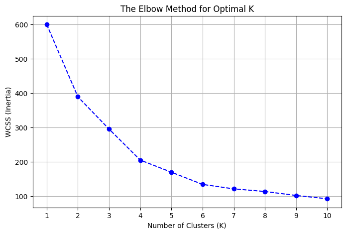
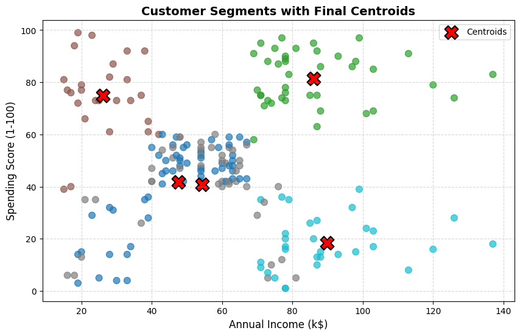
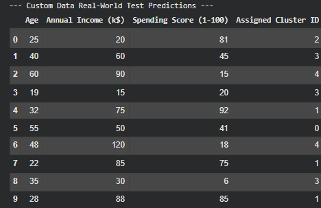

# K-Means Customer Segmentation Pipeline

## Cluster Descriptions
* **Cluster 0:** Represents younger, lower-income individuals who maintain a very high spending score.
* **Cluster 1:** Identifies middle-aged, average earners who have moderate spending habits.
* **Cluster 2:** Captures high-income individuals who are highly conservative with their money and have low spending scores.
* **Cluster 3:** Defines older, low-to-moderate income individuals with low overall spending tendencies.
* **Cluster 4:** Represents affluent, high-income individuals who exhibit exceptionally high spending scores.
# K-Means Customer Segmentation Pipeline

## 📊 Project Visuals

### 1. The Elbow Curve Plot
The Elbow Method helps determine the optimal number of clusters ($K$) by looking for a clear "bend" in the curve.

---

### 2. Cluster Scatter Plot with Centroids
This graph maps our standard customer data into 5 distinct spending segments, with the final mathematical centroids marked as a Red X.

---

### 3. Custom Prediction Table Output
The following table shows our 10 real-world custom items alongside the exact Cluster ID assigned by our trained model.

